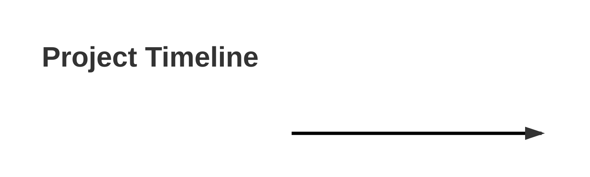

# Project Plan

## 📋 Overview
This document tracks all tasks for the project using a Kanban-style approach with dependency tracking.

## 📊 Project Stats
- **Total Tasks:** 0
- **Todo:** 0
- **In Progress:** 0
- **Done:** 0
- **Completion Rate:** 0%
- **Estimated Total Hours:** 0
- **Hours Logged:** 0

## 🔄 Workflow
1. New tasks are created using the task template and placed in the 	odo folder
2. When work begins on a task, move it to the inprogress folder
3. When a task is completed, move it to the done folder
4. Update this plan.md file to reflect the current state of all tasks
5. Update dependency information in related tasks

## 📝 Task Template
The task template (project templates/task-template.md) combines elements from a standard task template and the implementation plan template. It includes:

- **Metadata**: Basic task information (ID, title, dates, priority, status, etc.)
- **Implementation Status**: Table showing progress of individual steps
- **Detailed Description**: Comprehensive explanation of the task
- **Acceptance Criteria**: Checklist of requirements for completion
- **Implementation Steps**: Detailed breakdown of how to complete the task
- **Dependencies**: Tasks that this task depends on and tasks that depend on this task
- **Testing Strategy**: How the implementation will be tested
- **Technical Considerations**: Any technical details or challenges
- **Time Tracking**: Estimated and actual hours spent

Use this template for all new tasks to ensure consistency and completeness.

## 📊 Dependency Graph

`mermaid
graph TD
    classDef todo fill:#ff9999;
    classDef inprogress fill:#99ccff;
    classDef done fill:#99ff99;
`

## 📅 Timeline

## 📊 Task Summary

| ID | Status | Title | Priority | Due Date | Assigned To | Progress |
|----|--------|-------|----------|----------|-------------|----------|
| TASK-001 | 📌 Todo | Implement Zustand Subscription Store | High | 2023-11-30 | Dev Team | 0% |
| TASK-002 | 🔨 In Progress | Create Subscription Edit Form | Medium | 2023-11-25 | UI Team | 43% |
| TASK-003 | ✅ Done | Implement Subscription Table UI | High | 2023-11-15 | UI Team | 100% |
| TASK-004 | 📌 Todo | Implement Subscription Listing Page | High | 2023-12-05 | UI Team | 0% |
| TASK-005 | 📌 Todo | Implement Subscription Actions | Medium | 2023-12-10 | Dev Team | 0% |
## 📅 Recent Updates

- 2025-05-21 - Updated plan.md with latest task statuses

- 2025-05-21 - Initial project plan created

