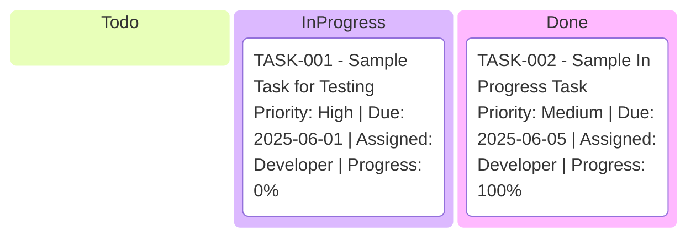

# Project Plan

## 📊 Project Stats
- **Total Tasks:** 2
- **✅ Done:** 14
- **⏳ In Progress:** 14
- **📋 Todo:** 0
- **🎯 Completion Rate:** 700%
- **⏱️ Estimated Total Hours:** 13
- **⏱️ Hours Logged:** 3

## 📋 Kanban Board

## 📝 Task Summary
| ID | Status | Title | Priority | Due Date | Assigned To | Progress |
|----|--------|-------|----------|----------|-------------|----------|
| TASK-001 | In Progress | Sample Task for Testing | High | 2025-06-01 | Developer | 0% |
| TASK-002 | Done | Sample In Progress Task | Medium | 2025-06-05 | Developer | 100% |

## 🔗 Task Dependencies
| Task ID | Task Name | Depends On | Required By |
|---------|-----------|------------|-------------|
| TASK-001 | Sample Task for Testing |  |  |
| TASK-002 | Sample In Progress Task |  |  |

## ⏳ Timeline

## 🔄 Recent Updates

- 2025-05-21 - Plan updated.
