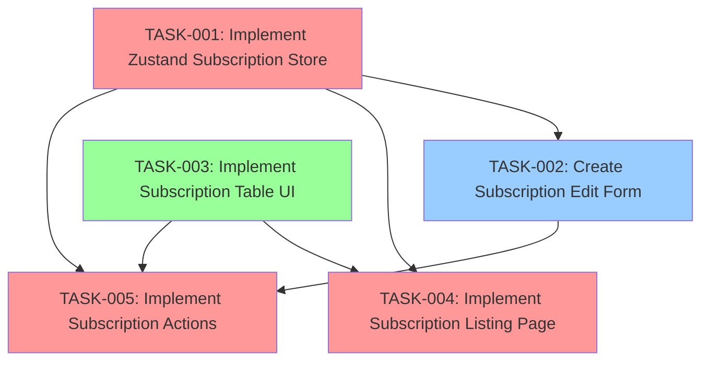
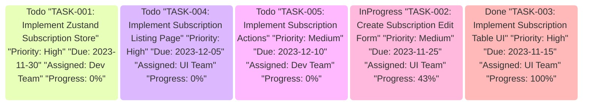

# SubsHero Project Plan

## 📋 Overview
This document tracks all tasks for the SubsHero project using a Kanban-style approach with dependency tracking.

## 📊 Project Stats
- **Total Tasks:** 5
- **Todo:** 3
- **In Progress:** 1
- **Done:** 1
- **Completion Rate:** 20%
- **Estimated Total Hours:** 57
- **Hours Logged:** 20

## 🔄 Workflow
1. New tasks are created using the task template and placed in the `todo` folder
2. When work begins on a task, move it to the `inprogress` folder
3. When a task is completed, move it to the `done` folder
4. Update this plan.md file to reflect the current state of all tasks
5. Update dependency information in related tasks

## 📝 Task Template
The task template (`docs/planning/task-template.md`) combines elements from a standard task template and the implementation plan template. It includes:

- **Metadata**: Basic task information (ID, title, dates, priority, status, etc.)
- **Implementation Status**: Table showing progress of individual steps
- **Detailed Description**: Comprehensive explanation of the task
- **Acceptance Criteria**: Checklist of requirements for completion
- **Implementation Steps**: Detailed breakdown of how to complete the task
- **Dependencies**: Tasks that this task depends on and tasks that depend on this task
- **Testing Strategy**: How the implementation will be tested
- **Technical Considerations**: Any technical details or challenges
- **Time Tracking**: Estimated and actual hours spent

Use this template for all new tasks to ensure consistency and completeness.

## 📊 Dependency Graph



## 📅 Timeline

```mermaid
gantt
    title Project Timeline
    dateFormat  YYYY-MM-DD

    section Subscription Store
    TASK-001: Implement Zustand Subscription Store :t1, 2023-11-15, 15d

    section UI Components
    TASK-003: Implement Subscription Table UI :done, t3, 2023-11-01, 2023-11-15
    TASK-002: Create Subscription Edit Form :active, t2, 2023-11-10, 15d

    section Features
    TASK-004: Implement Subscription Listing Page :t4, after t1 t3, 20d
    TASK-005: Implement Subscription Actions :t5, after t1 t2 t3, 25d
```

## 🔄 Task Dependencies

| Task ID | Task Name | Depends On | Required By |\n|---------|-----------|------------|------------|\n| TASK-002 | Create Subscription Edit Form | TASK-005 | TASK-001 |\n| TASK-003 | Implement Subscription Table UI | TASK-004, TASK-005 |  |\n| TASK-005 | Implement Subscription Actions |  | TASK-001, TASK-002, TASK-003 |\n| TASK-001 | Implement Zustand Subscription Store | TASK-002, TASK-004 |  |\n| TASK-004 | Implement Subscription Listing Page |  | TASK-001, TASK-003 |\n
## 📋 Kanban Board



## 📊 Task Summary

| ID | Status | Title | Priority | Due Date | Assigned To | Progress |
|----|--------|-------|----------|----------|-------------|----------|
| TASK-001 | 📌 Todo | Implement Zustand Subscription Store | High | 2023-11-30 | Dev Team | 0% |
| TASK-002 | 🔨 In Progress | Create Subscription Edit Form | Medium | 2023-11-25 | UI Team | 43% |
| TASK-003 | ✅ Done | Implement Subscription Table UI | High | 2023-11-15 | UI Team | 100% |
| TASK-004 | 📌 Todo | Implement Subscription Listing Page | High | 2023-12-05 | UI Team | 0% |
| TASK-005 | 📌 Todo | Implement Subscription Actions | Medium | 2023-12-10 | Dev Team | 0% |

## 📅 Recent Updates
- 2025-05-21 - Updated plan.md with latest task statuses
- 2023-11-15 - Initial project plan created
- 2023-11-15 - Added three sample tasks to demonstrate the Kanban system
- 2023-11-15 - Enhanced task template with improved dependency tracking
- 2023-11-15 - Added dependency graph and timeline visualizations
- 2023-11-15 - Created two additional tasks (TASK-004 and TASK-005) to complete the dependency graph


