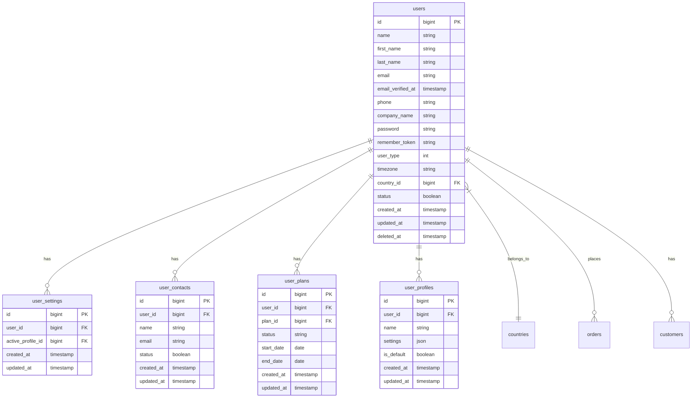
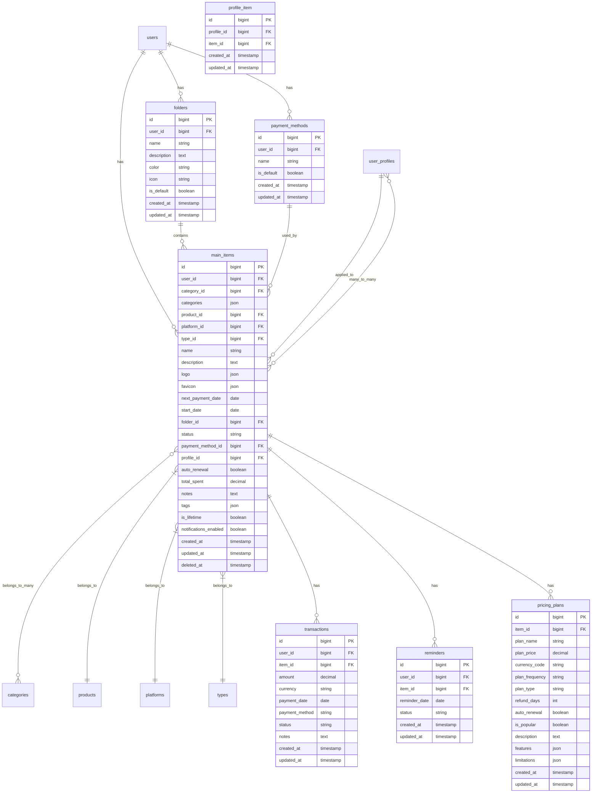
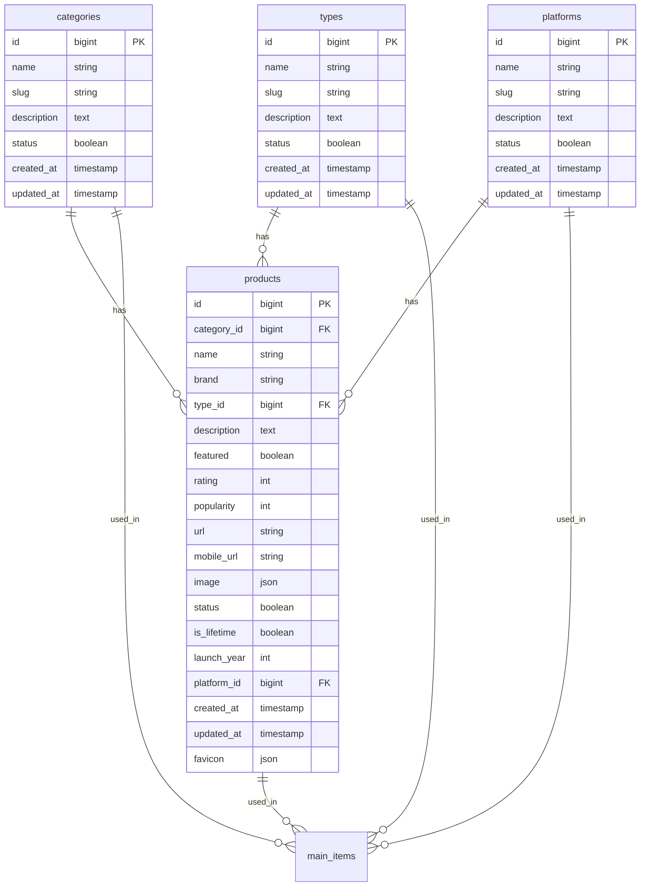
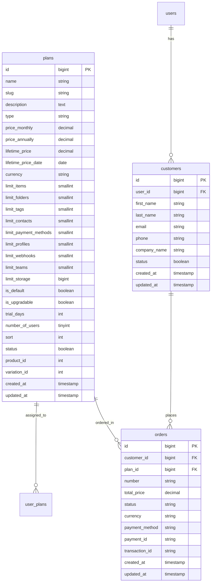
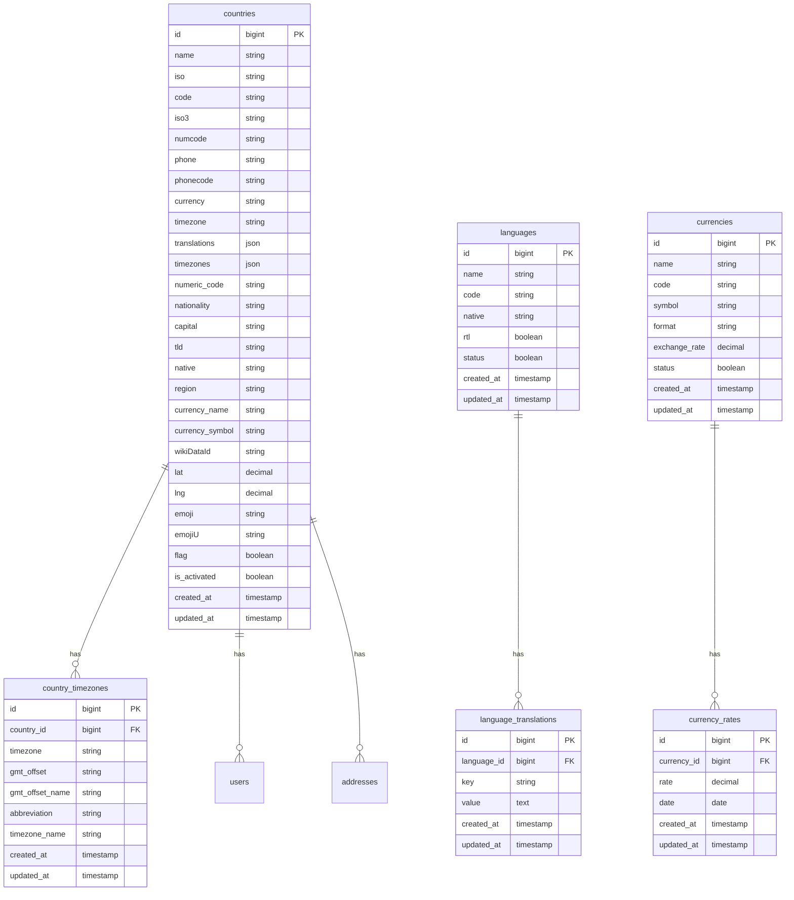
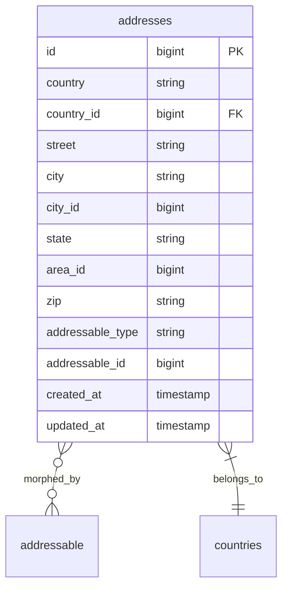

# Database Schema Visualization Template

This document provides a comprehensive visual representation of the database schema using Mermaid diagrams. The diagrams are organized by functional areas to make it easier to understand the relationships between tables.

## Core User Tables

## Main Feature Tables

## Product Catalog Tables

## E-commerce Tables

## System Settings Tables

## Address System

## Relationships Summary

### User Relationships
- A user can have one user setting
- A user can have many contacts
- A user can have many folders
- A user can have many payment methods
- A user can have many profiles
- A user can have many main items
- A user can have many plans
- A user can have many orders
- A user belongs to a country

### Main Item Relationships
- A main item belongs to a user
- A main item can belong to many categories (stored as JSON)
- A main item belongs to a product
- A main item belongs to a platform
- A main item belongs to a type
- A main item belongs to a folder
- A main item belongs to a payment method
- A main item belongs to a profile
- A main item can have many transactions
- A main item can have many reminders
- A main item can have many pricing plans
- A main item can belong to many profiles
- A main item stores logo and favicon as JSON arrays

### Product Relationships
- A product belongs to a category
- A product belongs to a type
- A product belongs to a platform
- A product can have many main items

### E-commerce Relationships
- A plan can have many user plans
- A plan can have many orders
- A customer belongs to a user
- A customer can have many orders

### System Settings Relationships
- A country can have many timezones
- A country can have many users
- A country can have many addresses
- A language can have many translations
- A currency can have many rates

## Database Schema Evolution

The database schema should evolve to support new features and requirements of the application. Consider documenting major changes here:

1. **User Management**: [Describe improvements to user model]
2. **Main Feature System**: [Describe comprehensive management system]
3. **Product Catalog**: [Describe catalog structure]
4. **E-commerce System**: [Describe e-commerce capabilities]
5. **System Settings**: [Describe system settings structure]

## Conclusion

This document provides a comprehensive visual representation of the database schema using Mermaid diagrams. The diagrams are organized by functional areas to make it easier to understand the relationships between tables. This documentation will be invaluable for developers working on the application, helping them understand the database structure and relationships.

## Notes for AI Agent

When populating this template:
1. Replace generic terms (main_items, folders, etc.) with application-specific terms
2. Update table fields based on actual requirements
3. Ensure relationships accurately reflect the application's data model
4. Add or remove tables as needed for the specific application
5. Update the Relationships Summary section to match the actual schema
6. Document schema evolution specific to the project
7. Consider adding indexes and constraints in the diagram if relevant
