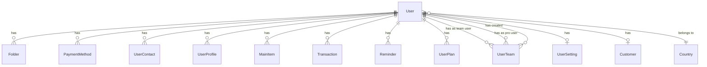
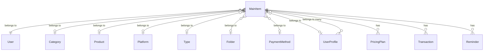
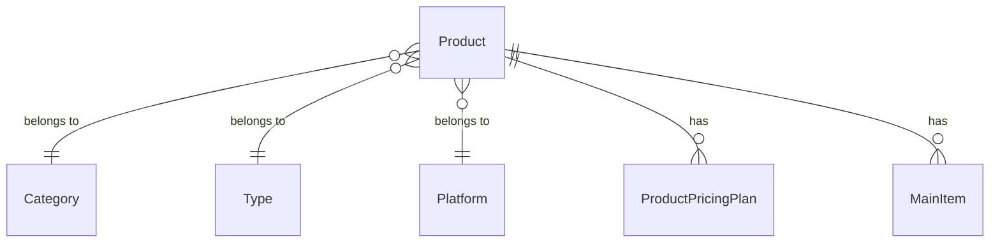
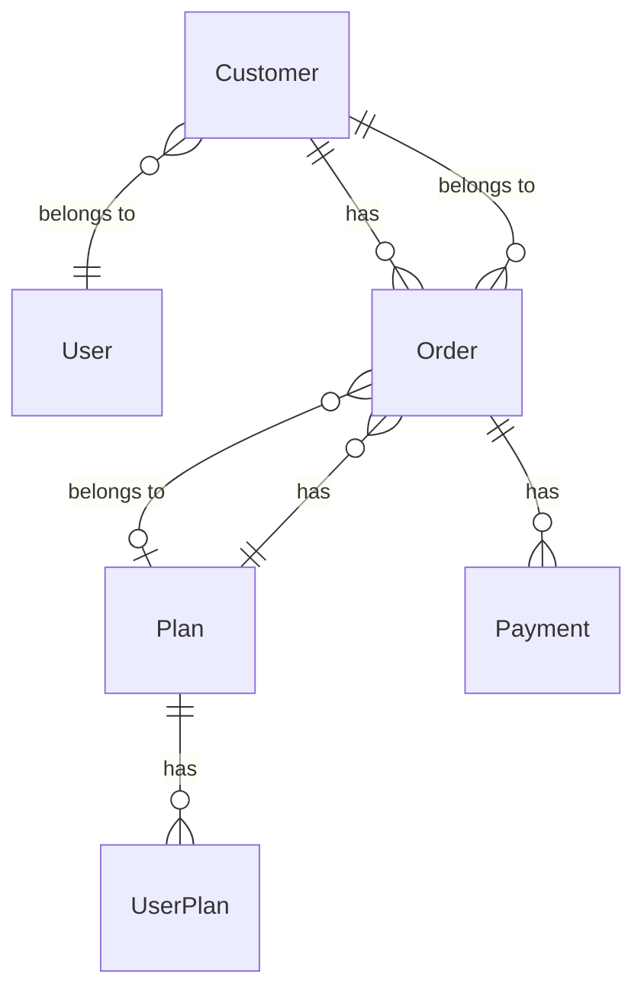
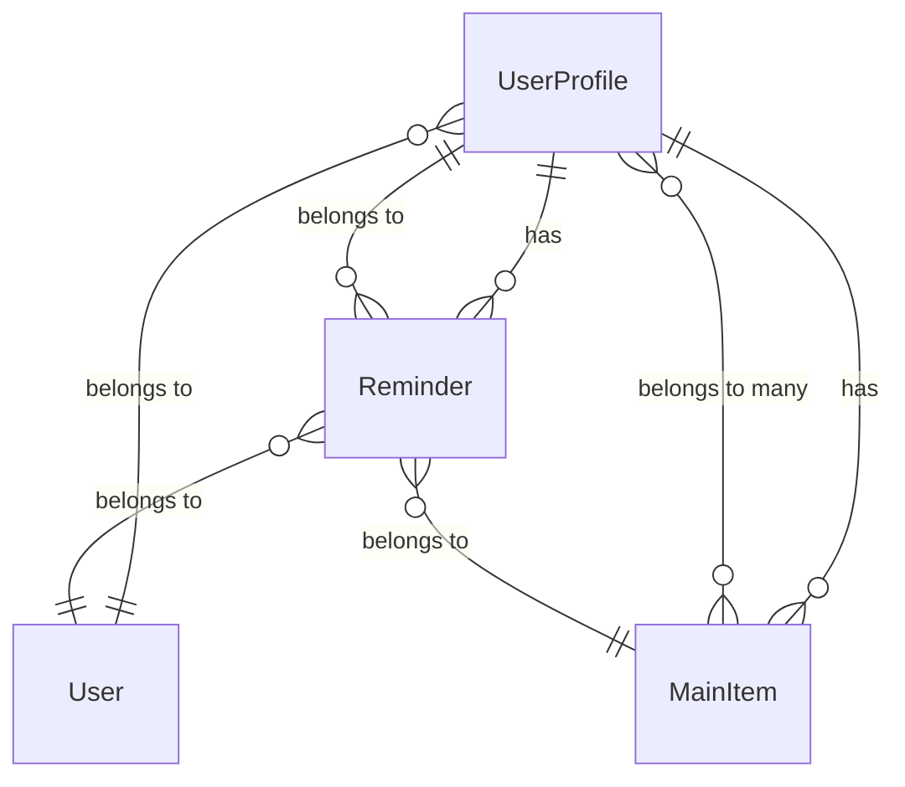
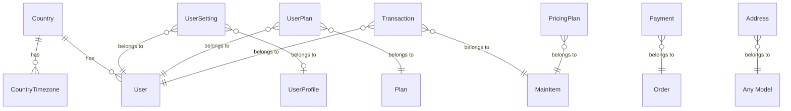

# Model Relationships Template

This document outlines the relationships between models in the application. Use this template to document how your models relate to each other, which is essential for understanding the application's data flow and structure.

## Core User-Related Relationships



## Main Feature Relationships



## Product-Related Relationships



## E-commerce Relationships



## Notification-Related Relationships



## Other Relationships



## Notes on Model Naming Conventions

When implementing these relationships in your codebase, follow these naming conventions:
- Use singular, PascalCase names for model classes (e.g., `User`, not `Users`)
- Use camelCase for relationship methods (e.g., `userContacts()`, not `UserContacts()`)
- Use snake_case for database columns (e.g., `user_id`, not `userId`)

## Implementation Examples

### Example: User Model Relationships

```php
class User extends Model
{
    // One-to-Many relationships
    public function folders()
    {
        return $this->hasMany(Folder::class);
    }

    public function paymentMethods()
    {
        return $this->hasMany(PaymentMethod::class);
    }

    // One-to-One relationships
    public function setting()
    {
        return $this->hasOne(UserSetting::class);
    }

    // Belongs-To relationships
    public function country()
    {
        return $this->belongsTo(Country::class);
    }
}
```

### Example: MainItem Model Relationships

```php
class MainItem extends Model
{
    // Belongs-To relationships
    public function user()
    {
        return $this->belongsTo(User::class);
    }

    public function folder()
    {
        return $this->belongsTo(Folder::class);
    }

    // One-to-Many relationships
    public function transactions()
    {
        return $this->hasMany(Transaction::class);
    }

    // Many-to-Many relationships
    public function profiles()
    {
        return $this->belongsToMany(UserProfile::class, 'profile_item');
    }
}
```

## Notes for AI Agent

When populating this template:
1. Replace generic model names with application-specific names
2. Ensure relationship types (one-to-many, many-to-many, etc.) are correctly represented
3. Update the implementation examples with actual model names and relationships
4. Add any additional relationship diagrams specific to the application
5. Consider adding notes about polymorphic relationships if used
6. Include any special relationship configurations or constraints
