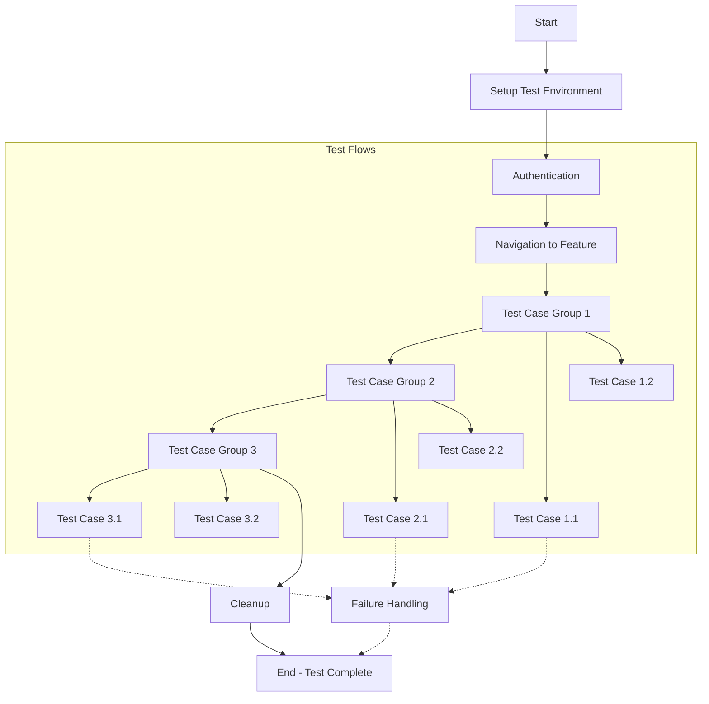

# [Feature Name] Automated Test Plan

## 1. Test Environment
- **Application URL**: [URL]
- **Username**: [Test User Email]
- **Password**: [Test User Password]
- **Test Framework**: [e.g., Cypress, Playwright, Selenium]
- **Repository**: [Link to test code repository]

## 2. Functionality Overview
[Provide a high-level description of the functionality being tested and its key components. Explain what the feature does and why it's important.]

Key features include:
- [Feature component 1]
- [Feature component 2]
- [Feature component 3]
- [Feature component 4]
- [Feature component 5]

This automated test suite covers [scope of what's being tested], focusing on [key aspects of testing].

## 3. Test Flow Diagram



## 4. Test Scenarios & Automation

### Setup and Prerequisites
- **Test ID**: SETUP-001
- **Description**: Initialize test environment and authenticate
- **Automation Notes**:
  ```javascript
  // Example setup code
  beforeEach(() => {
    cy.visit('/login');
    cy.login(TEST_USERNAME, TEST_PASSWORD);
    cy.navigateTo('[Feature Path]');
  });
  ```

### Test Group 1: [Core Functionality Tests]

#### Test Case 1.1: [First Core Functionality]
- **Test ID**: CORE-001
- **Description**: [What this test verifies]
- **Preconditions**: [Any required state]
- **Test Steps**:
  1. [Step 1]
  2. [Step 2]
  3. [Step 3]
- **Expected Results**: [What should happen]
- **Automation Implementation**:
  ```javascript
  it('should [expected behavior]', () => {
    // Test implementation
    cy.get('[selector]').should('be.visible');
    cy.get('[selector]').click();
    cy.get('[result-selector]').should('contain', 'Expected Result');
  });
  ```

#### Test Case 1.2: [Second Core Functionality]
- **Test ID**: CORE-002
- **Description**: [What this test verifies]
- **Preconditions**: [Any required state]
- **Test Steps**:
  1. [Step 1]
  2. [Step 2]
  3. [Step 3]
- **Expected Results**: [What should happen]
- **Automation Implementation**:
  ```javascript
  it('should [expected behavior]', () => {
    // Test implementation
    cy.get('[selector]').should('be.visible');
    cy.get('[selector]').type('test input');
    cy.get('[result-selector]').should('contain', 'Expected Result');
  });
  ```

### Test Group 2: [Edge Cases and Validation]

#### Test Case 2.1: [Edge Case 1]
- **Test ID**: EDGE-001
- **Description**: [What this test verifies]
- **Preconditions**: [Any required state]
- **Test Steps**:
  1. [Step 1]
  2. [Step 2]
  3. [Step 3]
- **Expected Results**: [What should happen]
- **Automation Implementation**:
  ```javascript
  it('should handle [edge case]', () => {
    // Test implementation
    cy.intercept('GET', '/api/endpoint', { fixture: 'edge-case-response.json' });
    cy.get('[selector]').click();
    cy.get('[error-message-selector]').should('contain', 'Expected Error Message');
  });
  ```

#### Test Case 2.2: [Validation Test]
- **Test ID**: VAL-001
- **Description**: [What this test verifies]
- **Preconditions**: [Any required state]
- **Test Steps**:
  1. [Step 1]
  2. [Step 2]
  3. [Step 3]
- **Expected Results**: [What should happen]
- **Automation Implementation**:
  ```javascript
  it('should validate [condition]', () => {
    // Test implementation
    cy.get('[input-selector]').type('invalid input');
    cy.get('[submit-button]').click();
    cy.get('[validation-message]').should('be.visible');
  });
  ```

### Test Group 3: [Performance and Load Tests]

#### Test Case 3.1: [Performance Test]
- **Test ID**: PERF-001
- **Description**: [What this test verifies]
- **Preconditions**: [Any required state]
- **Test Steps**:
  1. [Step 1]
  2. [Step 2]
  3. [Step 3]
- **Expected Results**: [What should happen]
- **Automation Implementation**:
  ```javascript
  it('should load within performance thresholds', () => {
    // Test implementation with performance tracking
    const start = performance.now();
    cy.get('[selector]').click();
    cy.get('[result-selector]').should('be.visible').then(() => {
      const end = performance.now();
      const loadTime = end - start;
      expect(loadTime).to.be.lessThan(1000); // Load time should be under 1 second
    });
  });
  ```

## 5. Test Data Management

### Test Fixtures
- **Fixture**: `test-data-1.json`
  ```json
  {
    "key": "value",
    "items": [
      {"id": 1, "name": "Item 1"},
      {"id": 2, "name": "Item 2"}
    ]
  }
  ```

- **Fixture**: `edge-case.json`
  ```json
  {
    "error": true,
    "message": "Error message for testing"
  }
  ```

### API Mocking Strategy
- Mock `/api/endpoint1` for standard test data
- Mock `/api/endpoint2` with empty results for edge cases
- Mock `/api/endpoint3` with error responses for error handling tests

## 6. Test Execution Guidelines

### Local Execution
```bash
# Install dependencies
npm install

# Run specific test file
npm test -- --spec "path/to/feature-test.js"

# Run all tests
npm test

# Run with specific browser
npm test -- --browser chrome
```

### CI/CD Integration
- Tests will run on pull requests to the main branch
- Tests will run nightly on the staging environment
- Failed tests will generate screenshots and videos
- Results will be reported to [Reporting System]

## 7. Reporting and Artifacts

### Expected Reports
- Test execution summary
- Detailed test results
- Coverage metrics
- Performance measurements
- Failure screenshots and videos

### Storage Location
- Test results: [Link to results dashboard]
- Test artifacts: [Link to artifacts storage]

## 8. Troubleshooting Common Issues

| Issue | Possible Cause | Resolution |
|-------|----------------|------------|
| Authentication failures | Token expiration | Refresh authentication or adjust token lifetime |
| Element not found | Dynamic element IDs or timing issues | Add proper wait strategies or use more stable selectors |
| API response timeouts | Network latency or service unavailability | Increase timeout thresholds or implement retry logic |
| Data consistency issues | Test data corruption | Reset test data before test execution |

## 9. Maintenance Strategy

- Tests to be reviewed monthly
- Update selectors when UI changes
- Update expected results when feature behavior changes
- Add new tests for new functionality
- Remove obsolete tests

## 10. References
- [Link to feature documentation]
- [Link to API documentation]
- [Link to test framework documentation] 