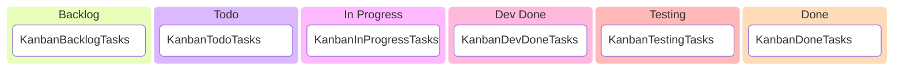
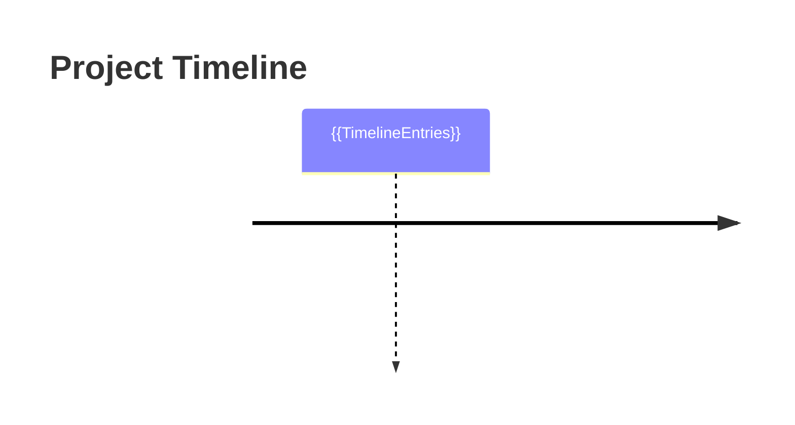

# {{ProjectName}}

## 📊 Project Stats
- **Total Tasks:** {{TotalTasks}}
- **✅ Done:** {{DoneCount}}
- **🧪 Testing:** {{TestingCount}}
- **🔄 Dev Done:** {{DevDoneCount}}
- **⏳ In Progress:** {{InProgressCount}}
- **📋 Todo:** {{TodoCount}}
- **📊 Backlog:** {{BacklogCount}}
- **🎯 Completion Rate:** {{CompletionRate}}%
- **⏱️ Estimated Total Hours:** {{TotalEstimatedHours}}
- **⏱️ Hours Logged:** {{TotalActualHours}}

## 📋 Kanban Board

## 📝 Task Summary
| ID | Status | Title | Type | Priority | Due Date | Assigned To | Progress |
|----|--------|-------|------|----------|----------|-------------|----------|
{{TaskSummaryTableRows}}

## 🔗 Task Dependencies
| Task ID | Task Name | Depends On | Required By |
|---------|-----------|------------|-------------|
{{TaskDependenciesTableRows}}

## ⏳ Timeline

## 🔄 Recent Updates
{{RecentUpdates}}
- {{CurrentDate}} - Plan updated.
