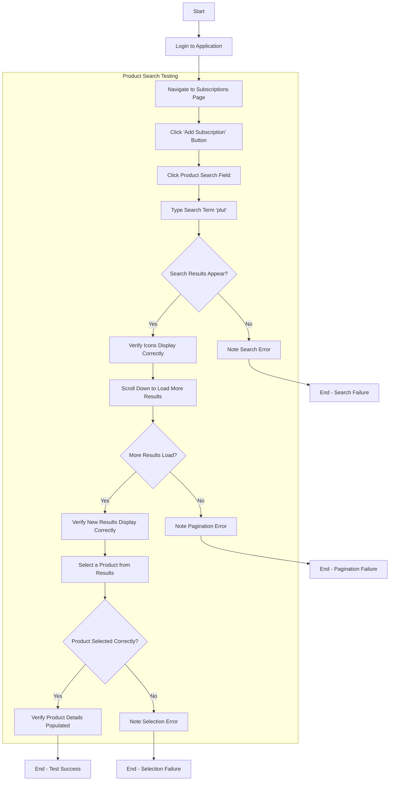

# Product Search Functionality Test

## 1. Test Credentials
- **Application URL**: https://subsheroload.test/
- **Username**: rohit@interstellarconsulting.com
- **Password**: rohit123

## 2. Functionality Overview
The Product Search functionality allows users to quickly find and select products when creating or editing subscriptions. Users can search for products by name, view product details including icons and subscription type (LTD/SUB), and select a product to add to their subscription. The search is optimized for performance with pagination and efficient API calls.

Key features include:
- Real-time search with debounced input to prevent excessive API calls
- Display of product icons, names, and subscription types (LTD/SUB)
- Infinite scrolling pagination to load more results as needed
- Proper handling of different favicon formats (array, object)
- Type-safe implementation with proper TypeScript support

This test covers the product search functionality, focusing on search performance, icon rendering, and pagination.

## 3. Test Flow Diagram

## 4. Test Steps

### Prerequisite Steps
1.  **Launch Application**
    *   Open a web browser
    *   Navigate to https://subsheroload.test/
2.  **Login to Application**
    *   Enter username: rohit@interstellarconsulting.com
    *   Enter password: rohit123
    *   Click the "Login" button
    *   Verify successful login (dashboard is displayed)
3.  **Navigate to Subscriptions Page**
    *   Locate and click on "Subscriptions" in the navigation
    *   Verify the Subscriptions page loads, showing existing subscriptions

### Part A: Basic Product Search Test

4.  **Initiate Subscription Creation**
    *   Click the "Create Subscription" button
    *   Verify the "Create Subscription" dialog appears
5.  **Test Product Search Field**
    *   Click on the product search field (labeled "Name")
    *   Type "plut" in the search field
    *   Verify search results appear after a short delay (debounce)
    *   Verify each result shows:
        * Product icon/favicon (if available)
        * Product name
        * LTD or SUB badge indicating subscription type
6.  **Verify Icon Rendering**
    *   Observe the product icons in the search results
    *   Verify icons are properly displayed and not broken/missing
    *   Verify icons maintain proper dimensions and alignment
7.  **Test Search Functionality**
    *   Clear the search field and type "adobe"
    *   Verify different search results appear
    *   Type a non-existent product name (e.g., "xyznonexistent")
    *   Verify appropriate "No results found" message is displayed

### Part B: Pagination Test

8.  **Test Infinite Scrolling**
    *   Clear the search field and type a common term that will return many results (e.g., "a")
    *   Wait for initial results to load
    *   Scroll down to the bottom of the results list
    *   Verify more results load automatically
    *   Continue scrolling to load additional pages
    *   Verify no errors appear in the console during pagination
9.  **Verify Pagination Consistency**
    *   Observe the transition between result pages
    *   Verify no duplicate results appear when loading more items
    *   Verify icons continue to display correctly for newly loaded results
    *   Verify the UI remains responsive during pagination

### Part C: Product Selection Test

10. **Select a Product**
    *   Search for a specific product (e.g., "Plutio")
    *   Click on one of the search results
    *   Verify the dialog remains open
    *   Verify the selected product name appears in the Name field
    *   Verify the LTD toggle is set correctly based on the selected product
11. **Verify Form Field Updates**
    *   Observe other form fields after product selection
    *   Verify any product-related fields are populated correctly
    *   If the product is marked as LTD, verify the plan type is set to "lifetime" and frequency to "one time"

## 5. Expected Outcomes

### Search Functionality
- Search results appear after typing with a short debounce delay
- Results display correctly with product name, icon, and LTD/SUB badge
- "No results found" message appears for non-existent products
- Search is case-insensitive and finds partial matches

### Icon Rendering
- Product icons/favicons display correctly in search results
- Icons maintain proper dimensions and alignment
- No broken images or missing icons for products with favicons
- Proper fallback for products without icons

### Pagination
- Additional results load automatically when scrolling to the bottom
- No errors appear in the console during pagination
- UI remains responsive during pagination
- No duplicate results appear when loading more items

### Product Selection
- Clicking a search result selects that product
- Selected product name appears in the Name field
- LTD toggle is set correctly based on the selected product
- Other product-related fields are populated correctly

## 6. Issues and Bugs

Document any issues encountered during testing below:

1.  **Icon Rendering Issue**
    *   **Issue**: Product icons not displaying correctly in search results.
    *   **Error Message**: [Document the exact error message]
    *   **Steps to Reproduce**: Search for products with icons, observe the search results.
    *   **Screenshots**: [Attach if available]
    *   **Resolution**: Fixed by updating getFaviconUrl function to handle both array and object formats of favicons and properly construct URL paths.

2.  **Pagination Error**
    *   **Issue**: Error when scrolling to load more results.
    *   **Error Message**: "The offset field must be an integer."
    *   **Steps to Reproduce**: Search for a term with many results, scroll down to load more.
    *   **Screenshots**: [Attach if available]
    *   **Resolution**: Fixed by ensuring proper integer parsing in loadMoreSearchResults function and correctly mapping Laravel pagination format to our custom format.

3.  **TypeScript Errors**
    *   **Issue**: TypeScript errors in useProductsStore.ts affecting development.
    *   **Details**: Errors related to createBaseStore initialization and API response type mapping.
    *   **Resolution**: Fixed by providing all required arguments to createBaseStore and updating API response type mapping to handle Laravel pagination format correctly.
