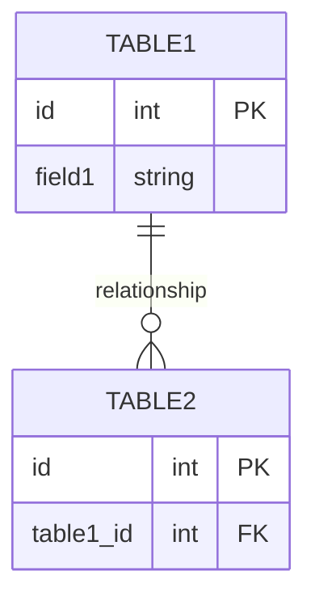

# Task: [Task ID] - [Task Title]

## Metadata
- **Created:** [YYYY-MM-DD]
- **Due:** [YYYY-MM-DD]
- **Priority:** [High/Medium/Low]
- **Status:** [Todo/InProgress/Done]
- **Assigned to:** [Name]
- **Sequence:** [Number indicating execution order]
- **Tags:** [tag1, tag2, ...]

## Overview
[Brief description of the task and its purpose]

## Implementation Status

| Step | Description | Status | Target Date |
|------|-------------|--------|-------------|
| 1 | [Step description] | ⏳ Pending | YYYY-MM-DD |
| 2 | [Step description] | ⏳ Pending | YYYY-MM-DD |
| 3 | [Step description] | ⏳ Pending | YYYY-MM-DD |

## Detailed Description
[Detailed description of the task, including its purpose, benefits, and any relevant background information]

## Acceptance Criteria
- [ ] Criterion 1
- [ ] Criterion 2
- [ ] Criterion 3
- [ ] Automated test plan created and reviewed
- [ ] Automated tests implemented and passing

## Implementation Steps with Checklists

### 1. [First Step]
[Description of the first implementation step]
- [ ] **1.1. Action Item**: [Brief description]
  - [ ] Sub-action 1.1.1: [Details]
  - [ ] Sub-action 1.1.2: [Details]
- [ ] **1.2. Action Item**: [Brief description]
  - [ ] Sub-action 1.2.1: [Details]

### 2. [Second Step]
[Description of the second implementation step]
- [ ] **2.1. Action Item**: [Brief description]
  - [ ] Sub-action 2.1.1: [Details]
  - [ ] Sub-action 2.1.2: [Details]
- [ ] **2.2. Action Item**: [Brief description]

### 3. [Third Step]
[Description of the third implementation step]
- [ ] **3.1. Action Item**: [Brief description]
  - [ ] Sub-action 3.1.1: [Details]
  - [ ] Sub-action 3.1.2: [Details]
  - [ ] Sub-action 3.1.3: [Details]

### 4. Testing
[Describe the testing approach for this task]
- [ ] **4.1. Create Test Plan**: Create the automated test plan
  - [ ] Create `[Feature Name]-automated-test.md` based on `automated-test-template.md`
  - [ ] Define test cases for core functionality
  - [ ] Define test cases for edge cases and validation
  - [ ] Review test plan with team
- [ ] **4.2. Implement Tests**: Develop automated tests
  - [ ] Implement core functionality tests
  - [ ] Implement edge case tests
  - [ ] Ensure tests pass consistently

## Dependencies
### Required By This Task
- [Task ID] - [Task Title] - [Status]

### Dependent On This Task
- [Task ID] - [Task Title] - [Status]

### Dependency Type
- **Blocking**: This task cannot start until the dependency is completed
- **Informational**: This task can start but may need information from the dependency
- **Related**: Tasks are related but not directly dependent

## Testing Strategy
[Describe the overall approach to testing this functionality]

### Manual Testing
[Outline manual testing requirements and approach]

### Automated Testing
An automated test plan should be created for this functionality using the standard template:
- Create a new file named `[Feature Name]-automated-test.md` based on the `automated-test-template.md`
- Complete all sections of the template with test cases specific to this functionality
- Include test code examples that can be implemented in the test framework
- Reference the test plan in implementation deliverables

The automated test plan should cover:
- Core functionality tests
- Edge cases and validation
- Performance considerations
- Any specific requirements for this feature

## Technical Considerations
[Any technical considerations, potential challenges, or architectural decisions]

### Database Changes
[If applicable, describe any database schema changes required]

## Time Tracking
- **Estimated hours:** [X]
- **Actual hours:** [X]

## References
- [Reference 1]
- [Reference 2]

## Updates
- [YYYY-MM-DD] - [Update description]
