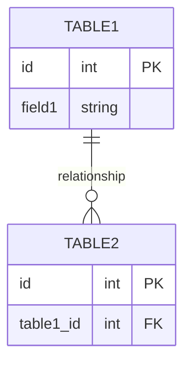

# Task: [Task ID] - [Task Title]

## Metadata
- **Created:** [YYYY-MM-DD]
- **Due:** [YYYY-MM-DD]
- **Priority:** [High/Medium/Low]
- **Status:** [Todo/InProgress/Done]
- **Assigned to:** [Name]
- **Sequence:** [Number indicating execution order]
- **Tags:** [tag1, tag2, ...]

## Overview
[Brief description of the task and its purpose]

## Implementation Status

| Step | Description | Status | Target Date |
|------|-------------|--------|-------------|
| 1 | [Step description] | ⏳ Pending | YYYY-MM-DD |
| 2 | [Step description] | ⏳ Pending | YYYY-MM-DD |
| 3 | [Step description] | ⏳ Pending | YYYY-MM-DD |

## Detailed Description
[Detailed description of the task, including its purpose, benefits, and any relevant background information]

## Acceptance Criteria
- [ ] Criterion 1
- [ ] Criterion 2
- [ ] Criterion 3

## Implementation Steps

### 1. [First Step]
[Description of the first implementation step]

### 2. [Second Step]
[Description of the second implementation step]

### 3. [Third Step]
[Description of the third implementation step]

## Subtasks Checklist
- [ ] **Subtask 1**: [Brief description of subtask]
  - [ ] Subtask 1.1: [Detailed action item]
  - [ ] Subtask 1.2: [Detailed action item]
  - [ ] Subtask 1.3: [Detailed action item]
- [ ] **Subtask 2**: [Brief description of subtask]
  - [ ] Subtask 2.1: [Detailed action item]
  - [ ] Subtask 2.2: [Detailed action item]
- [ ] **Subtask 3**: [Brief description of subtask]
  - [ ] Subtask 3.1: [Detailed action item]
  - [ ] Subtask 3.2: [Detailed action item]
  - [ ] Subtask 3.3: [Detailed action item]
  - [ ] Subtask 3.4: [Detailed action item]

## Dependencies
### Required By This Task
- [Task ID] - [Task Title] - [Status]

### Dependent On This Task
- [Task ID] - [Task Title] - [Status]

### Dependency Type
- **Blocking**: This task cannot start until the dependency is completed
- **Informational**: This task can start but may need information from the dependency
- **Related**: Tasks are related but not directly dependent

## Testing Strategy
[Description of how the implementation will be tested]

## Technical Considerations
[Any technical considerations, potential challenges, or architectural decisions]

### Database Changes
[If applicable, describe any database schema changes required]

## Time Tracking
- **Estimated hours:** [X]
- **Actual hours:** [X]

## References
- [Reference 1]
- [Reference 2]

## Updates
- [YYYY-MM-DD] - [Update description]
